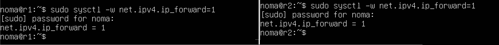

# Сети в Linux

> Полезные ссылки:\
> Лекция: https://21-school-by-students.notion.site/DevOps-82558dcf7615453abb875ad2d8ab349c \
> Add route on Linux using ip: https://devconnected.com/how-to-add-route-on-linux/ \
> Утилита Traceroute: https://help.reg.ru/support/hosting/razmeshcheniye-sayta-otobrazheniye-v-brauzere/utility-traceroute-i-tracert \
> Принципы работы протокола DHCP: https://selectel.ru/blog/dhcp-protocol/
> Использование сетевого плана: https://devconnected.com/how-to-add-route-on-linux/ \
> Как открыть порт в iptables? https://selectel.ru/blog/setup-iptables-linux/ \
> Протокол динамического выделения адресов (DHCP): https://help.ubuntu.ru/wiki/%D1%80%D1%83%D0%BA%D0%BE%D0%B2%D0%BE%D0%B4%D1%81%D1%82%D0%B2%D0%BE_%D0%BF%D0%BE_ubuntu_server/%D1%81%D0%B5%D1%82%D1%8C/dhcp \
> Iptables: https://ru.wikibooks.org/wiki/Iptables \
> Настройка NAT: https://selectel.ru/blog/setup-iptables-linux/ \
> Допустимыми действиями в таблице nat являются: MASQUERADE, SNAT, DNAT ... https://ru.wikibooks.org/wiki/Iptables \
> Local TCP forwarding: https://habr.com/ru/articles/331348/ \
> Памятка пользователям: https://habr.com/ru/articles/122445/

## Part 1. Инструмент ipcalc

Создаем виртуальную машину ws1.

#### 1.1. Сети и маски

- адрес сети 192.167.38.54/13
  

- перевод маски:\
  255.255.255.0 в префиксную и двоичную запись\
  /15 в обычную и двоичную\
  11111111.11111111.11111111.11110000 в обычную и префиксную\
  

- минимальный и максимальный хост в сети 12.167.38.4 при масках:\
  /8\
  11111111.11111111.00000000.00000000\
  255.255.254.0\
  /4\
  

#### 1.2. localhost

Определить и записать в отчёт, можно ли обратиться к приложению, работающему на localhost, со следующими IP: 194.34.23.100, 127.0.0.2, 127.1.0.1,128.0.0.1.\
Приложения к которым можно обратиться через localhost: 127.0.0.2, 127.1.0.1.


#### 1.3. Диапазоны и сегменты сетей

IP в качестве публичного: 134.43.0.2, 172.0.2.1, 172.68.0.2, 192.169.168.1, 192.172.0.1\
IP в качестве частных: 10.0.0.45, 192.168.4.2, 172.20.250.4, 172.16.255.255, 10.10.10.10\


У сети 10.10.0.0/18 возможны IP адреса шлюза: 10.10.0.2, 10.10.10.10\
Оставшиеся: 10.0.0.1, 10.10.100.1, 10.10.1.255\


## Part 2. Статическая маршрутизация между двумя машинами

> Использование сетевого плана: https://devconnected.com/how-to-add-route-on-linux/

Создаем вторую виртуальную машину ws2.\
С помощью команды ip a посмотрим существующие сетевые интерфейсы.\


Зададим следующие адреса и маски: ws1 - 192.168.100.10, маска /16, ws2 - 172.24.116.8, маска /12. И выполним команду netplan apply для перезапуска сервиса сети.\


#### 2.1. Добавление статического маршрута вручную.

Добавим статический маршрут от одной машины до другой и обратно при помощи команды вида ip r add.\


#### 2.2. Добавление статического маршрута с сохранением.

Перезапустим машины. Добавим статический маршрут от одной машины до другой с помощью файла etc/netplan/00-installer-config.yaml.\


## Part 3. Утилита iperf3

#### 3.1. Скорость соединения.

8 Mbps (мегабит в сек) => 1 MB/s (мегабайт в сек)\
100 MB/s (мегабайт в сек) => 800 000 Kbps (килобит в сек)\
1 Gbps (гигабит в сек) => 1 000 Mbps (мегабит в сек)

#### 3.2. Утилита iperf3.

Измерим скорость соединения между ws1 и ws2.\


## Part 4. Сетевой экран

После соединения машин, перед нами стоит следующая задача: контролировать информацию, проходящую по соединению. Для этого используются сетевые экраны.

#### 4.1. Утилита iptables.

> Как открыть порт в iptables? https://selectel.ru/blog/setup-iptables-linux/

Создаим файл /etc/firewall.sh, имитирующий фаерволл, на ws1 и ws2.
Нужно добавить в файл подряд следующие правила:

1. на ws1 применить стратегию когда в начале пишется запрещающее правило, а в конце пишется разрешающее правило (это касается пунктов 4 и 5).
2. на ws2 применить стратегию когда в начале пишется разрешающее правило, а в конце пишется запрещающее правило (это касается пунктов 4 и 5).
3. открыть на машинах доступ для порта 22 (ssh) и порта 80 (http).
4. запретить echo reply (машина не должна "пинговаться”, т.е. должна быть блокировка на OUTPUT).
5. разрешить echo reply (машина должна "пинговаться").

> Удаление всех правил в таблице "filter" (по-умолчанию). \
> iptables –F \
> iptables -X \
> Предположим, что политика по умолчанию — блокировать все, что явно не разрешено. Откроем порты веб-сервера для обеспечения работы HTTP протокола — порт 80(iptables -A INPUT -p tcp --dport 80 -j ACCEPT), по SSH откроем порт 22 (iptables -A INPUT -p tcp --dport 22 -j ACCEPT).


Запустим файлы на обеих машинах командами chmod +x /etc/firewall.sh и /etc/firewall.sh.
\
На первой машине ws1 сначала идет запрещающее правило echo reply(4) - ws1 не пингуется, а на второй машине наооборот сначала разрешен echo reply(5)- ws2 пингуется.

#### 4.2. Утилита nmap.

Командой ping найдем машину, которая не "пингуется", после чего утилитой nmap покажем, что хост машины запущен.
\
Проверка: в выводе nmap должно быть сказано: Host is up\
p.s. Сохраним дампы образов виртуальных машин.

## Part 5. Статическая маршрутизация сети

Создим пять виртуальных машин (3 рабочие станции (ws11, ws21, ws22) и 2 роутера (r1, r2)).

#### 5.1. Настройка адресов машин.

\
Настроим конфигурации машин в etc/netplan/00-installer-config.yaml согласно сети на рисунке.\


Перезапустим сервис сети. Если ошибок нет, то командой ip -4 a проверим, что адрес машины задан верно.\
\
Также пропингуем ws22 с ws21. Аналогично пропингуем r1 с ws11.\


#### 5.2. Включение переадресации IP-адресов.

Для включения переадресации IP, выполним команду на роутерах: sysctl -w net.ipv4.ip_forward=1\
При таком подходе переадресация не будет работать после перезагрузки системы.\


Откроем файл /etc/sysctl.conf и добавим в него следующую строку: net.ipv4.ip_forward = 1\
При использовании этого подхода, IP-переадресация включена на постоянной основе.\


#### 5.3. Установка маршрута по-умолчанию.

Настроим маршрут по-умолчанию (шлюз) для рабочих станций. Для этого добавим default перед IP роутера в файле конфигураций. Вызовем ip r и покажем, что добавился маршрут в таблицу маршрутизации. Пример вывода команды ip r после добавления шлюза:

```
default via 10.10.0.1 dev eth0
10.10.0.0/18 dev eth0 proto kernel scope link src 10.10.0.2
```


Пропингуем с ws11 роутер r2 и покажем на r2, что пинг доходит. (tcpdump -tn -i eth1).\


#### 5.4. Добавление статических маршрутов.

Добавить в роутеры r1 и r2 статические маршруты в файле конфигураций. Пример для r1 маршрута в сетку 10.20.0.0/26:

```
# Добавить в конец описания сетевого интерфейса eth1:
- to: 10.20.0.0
  via: 10.100.0.12
```


Вызвать ip r и показать таблицы с маршрутами на обоих роутерах. Пример таблицы на r1:

```
10.100.0.0/16 dev eth1 proto kernel scope link src 10.100.0.11
10.20.0.0/26 via 10.100.0.12 dev eth1
10.10.0.0/18 dev eth0 proto kernel scope link src 10.10.0.1
```


Запустить команды на ws11: ip r list 10.10.0.0/[маска сети] и ip r list 0.0.0.0/0\


Маршрут до сети 10.10.0.0/18 - машина находится в этой сети, не надо обращаться к роутеру.
В случае с 0.0.0.0/0 - это немаршрутизируемый адрес IPv4, который можно использовать в разных целях, в основном, в качестве адреса по умолчанию.

#### 5.5. Построение списка маршрутизаторов.

> Traceroute: https://help.reg.ru/support/hosting/razmeshcheniye-sayta-otobrazheniye-v-brauzere/utility-traceroute-i-tracert \
> Команда traceroute позволяет узнать, где в данный момент находится пакет, и почему его нельзя доставить по заданному маршруту.
> Команда traceroute применяет протокол UDP и функцию создания отчета об ошибках, предусмотренную в ICMP. Эта команда трижды отправляет пакет UDP каждому шлюзу или маршрутизатору, входящему в маршрут. Первый пакет отправляется ближайшему шлюзу. Второй пакет отправляется следующему за ним транзитному узлу и т.д. Последний пакет отправляется целевой системе. В выводе команды указывается имя шлюза, IP-адрес шлюза и время оборота трех пакетов, отправленных шлюзу.
> Утилита Traceroute отправляет 3 UDP-пакета на определенный порт целевого хоста и ожидает ответа о недоступности этого порта. Первый пакет отправляется с TTL=1(Time To Live — время жизни пакета) , второй с TTL=2 и так далее, пока запрос не попадёт адресату. Отличие от Tracert в том, как Traceroute понимает, что трассировка завершена. Так как вместо ICMP-запроса он отправляет UDP-запрос, в каждом запросе есть порт отправителя (Sourсe) и порт получателя (Destination). По умолчанию запрос отправляется на закрытый порт 34434. Когда запрос попадёт на хост назначения, этот хост отправит ответ о недоступности порта «Destination port unreachable» (порт назначения недоступен). Это значит, что адресат получил запрос. Traceroute воспримет этот ответ как завершение трассировки.\
> Пример вывода утилиты traceroute после добавления шлюза:
>
> ```
> 1 10.10.0.1 0 ms 1 ms 0 ms
> 2 10.100.0.12 1 ms 0 ms 1 ms
> 3 10.20.0.10 12 ms 1 ms 3 ms
> ```

Запустим на r1 команду дампа: tcpdump -tnv -i eth0. При помощи утилиты traceroute построим список маршрутизаторов на пути от ws11 до ws21.


#### 5.6. Использование протокола ICMP при маршрутизации.

Запустим на r1 перехват сетевого трафика с помощью команды: tcpdump -n -i enp0s8 icmp.Пропингуем с ws11 несуществующий IP (например, 10.30.0.111).\
\
p.s. Сохраним дампы образов виртуальных машин.

## Part 6. Динамическая настройка IP с помощью DHCP

> Принципы работы протокола DHCP: https://selectel.ru/blog/dhcp-protocol/ \
> Протокол динамического выделения адресов (DHCP): https://help.ubuntu.ru/wiki/%D1%80%D1%83%D0%BA%D0%BE%D0%B2%D0%BE%D0%B4%D1%81%D1%82%D0%B2%D0%BE_%D0%BF%D0%BE_ubuntu_server/%D1%81%D0%B5%D1%82%D1%8C/dhcp

> Протокол DHCP, получение адреса IP — DORA.\
> -Discovery, или поиск. Изначально клиент находится в состоянии инициализации (INIT) и не имеет своего IP-адреса. Поэтому он отправляет широковещательное (broadcast) сообщение DHCPDISCOVER на все устройства в локальной сети. В той же локальной сети находится DHCP-сервер. DHCP-сервер — это, например, маршрутизатор или коммутатор, существуют также выделенные DHCP-серверы.\
> -Offer, или предложение. DHCP-сервер отвечает на поиск предложением, он сообщает IP, который может подойти клиенту. IP выделяются из области (SCOPE) доступных адресов, которая задается администратором. Сохранение IP для отдельных клиентов называют резервацией (reservation).DHCPOFFER содержит IP из доступной области, который предлагается клиенту отправкой широковещательного (broadcast, «если вы тот, кто запрашивал IP-адрес, то доступен вот такой») или прямого (unicast, «вы запрашивали IP, предлагаю вот такой») сообщения. При этом, поскольку нужный клиент пока не имеет IP, для отправки прямого сообщения он идентифицируется по MAC-адресу.\
> -Request, или запрос. Клиент получает DHCPOFFER, а затем отправляет на сервер сообщение DHCPREQUEST. Этим сообщением он принимает предлагаемый адрес и уведомляет DHCP-сервер об этом. Широковещательное сообщение почти полностью дублирует DHCPDISCOVER, но содержит в себе уникальный IP, выделенный сервером. Таким образом, клиент сообщает всем доступным DHCP-серверам «да, я беру этот адрес», а сервера помечают IP как занятый.\
> -Acknowledgement, или подтверждение. Сервер получает от клиента DHCPREQUEST и окончательно подтверждает передачу IP-адреса клиенту сообщением DHCPACK. Это широковещательное или прямое сообщение утверждает не только владельца IP, но и срок, в течение которого клиент может использовать этот адрес.

Следующим нашим шагом будет более подробное знакомство со службой DHCP. В данном задании используются виртуальные машины из Части 5.

Для r2 настроим в файле /etc/dhcp/dhcpd.conf конфигурацию службы DHCP:

1. указать адрес маршрутизатора по-умолчанию, DNS-сервер и адрес внутренней сети.
2. в файле resolv.conf прописать nameserver 8.8.8.8.
   Перезагрузим службу DHCP командой systemctl restart isc-dhcp-server.

Пример файла для r2:

```
subnet 10.100.0.0 netmask 255.255.0.0 {}
subnet 10.20.0.0 netmask 255.255.255.192
{
    range 10.20.0.2 10.20.0.50;
    option routers 10.20.0.1;
    option domain-name-servers 10.20.0.1;
}
```

> default-lease-time — время аренды(в секундах) адреса у сервера, если клиент не запросил другое;\
> max-lease-time — максимальное время аренды адреса;\
> subnet — описывает сеть ip и её маску;\
> range — диапазон адресов с которых по запросу клиента будут предоставляться адреса;\
> option routers — адрес роутера. Это должен быть адрес интерфейса через который пользователи попадают в интернет.\
> option domain-name-servers — адрес DNS сервера. Указывает на то, что сервер расположен на этом же компьютере

Машину ws21 перезагрузим при помощи reboot и через ip a показать, что она получила адрес 8, пропингуем ws21 с ws22.


Укажем MAC адрес у ws11, для этого в etc/netplan/00-installer-config.yaml надо добавить строки: macaddress: 10:10:10:10:10:BA, dhcp4: true. Для r1 настроить аналогично r2, но сделать выдачу адресов с жесткой привязкой к MAC-адресу (ws11). Проведем аналогичные тесты.\


Запросим с ws21 обновление ip адреса. Поместим скрины ip до и после обновления.\


> DHCP Options:\
> -Опция 1 - IP-маска подсети;\
> -Опция 6 - Адрес DNS-сервера (основной и резервный);\

p.s. Сохраним дампы образов виртуальных машин

## Part 7. NAT

> https://ru.wikibooks.org/wiki/Iptables \
> Таблица filter Предназначена для фильтрации трафика, то есть разрешения и запрещения пакетов и соединений.\
> Таблица filter содержит следующие цепочки:\
> INPUT — эта цепочка обрабатывает трафик, поступающий непосредственно самому хосту.\
> FORWARD — позволяет фильтровать транзитный трафик.\
> OUTPUT — эта цепочка позволяет фильтровать трафик, исходящий от самого хоста.

> Допустимыми действиями в таблице filter являются:\
> ACCEPT — пропуск пакета. Пакет покидает текущую базовую цепочку и следует дальше по потоковой диаграмме.\
> REJECT — заблокировать пакет и сообщить его источнику об отказе. По умолчанию об отказе сообщается отправкой ответного ICMP-пакета «icmp-port-unreachable». Однако, это действие поддерживает опцию --reject-with, позволяющую указать формулировку сообщения об отказе. Для протокола TCP поддерживается отказ в форме отправки RST-пакета (--reject-with tcp-reset).\
> DROP — заблокировать пакет, не сообщая источнику об отказе. Более предпочтительна при фильтрации трафика на интерфейсах, подключенных к интернету, так как понижает информативность сканирования портов хоста злоумышленниками.

Механизм преобразования адресов. В данном задании используются виртуальные машины из Части 5.

В файле /etc/apache2/ports.conf на ws22 и r1 изменим строку Listen 80 на Listen 0.0.0.0:80, то есть сделаем сервер Apache2 общедоступным.Запустим веб-сервер Apache командой service apache2 start на ws22 и r1.\


Добавим в фаервол, созданный по аналогии с фаерволом из Части 4, на r2 следующие правила:

1. удаление правил в таблице filter - iptables -F
2. удаление правил в таблице "NAT" - iptables -F -t nat
3. отбрасывать все маршрутизируемые пакеты - iptables --policy FORWARD DROP\
   Запустим файл также, как в Части 4. И проверим соединение между ws22 и r1 командой ping. При запуске файла с этими правилами, ws22 не должна "пинговаться" с r1.\
   

Добавим в файл ещё одно правило:\
4. разрешить маршрутизацию всех пакетов протокола ICMP. Запускаем файл также, как в Части 4. Проверим соединение между ws22 и r1 командой ping. При запуске файла с этими правилами, ws22 должна "пинговаться" с r1.\


> Настройка NAT: https://selectel.ru/blog/setup-iptables-linux/ \
> Допустимыми действиями в таблице nat являются: MASQUERADE, SNAT, DNAT ... https://ru.wikibooks.org/wiki/Iptables

Добавим в файл ещё два правила:\
5. включить SNAT, а именно маскирование всех локальных ip из локальной сети, находящейся за r2.

6. включить DNAT на 8080 порт машины r2 и добавить к веб-серверу Apache, запущенному на ws22, доступ извне сети.\
   Стоит учесть, что при попытке подключения возникнет новое tcp-соединение, предназначенное ws22 и 80 порту.\
   Проверим соединение по TCP для SNAT, для этого с ws22 подключимся к серверу Apache на r1 командой: telnet [адрес] [порт].\
   Проверим соединение по TCP для DNAT, для этого с r1 подключимся к серверу Apache на ws22 командой telnet (обращаться по адресу r2 и порту 8080).\
   
   p.s. Сохраним дампы образов виртуальных машин.
