# Simple Docker

## Contents

1. [Chapter I](#chapter-i)
2. [Chapter II](#chapter-ii) 
3. [Chapter III](#chapter-iii) \
    3.1. [Готовый докер](#part-1-готовый-докер) \
    3.2. [Операции с контейнером](#part-2-операции-с-контейнером) \
    3.3. [Мини веб-сервер](#part-3-мини-веб-сервер) \
    3.4. [Свой докер](#part-4-свой-докер) \
    3.5. [Dockle](#part-5-dockle) \
    3.6. [Базовый Docker Compose](#part-6-базовый-docker-compose)

## Chapter I

Введение в докер. Разработка простого докер образа для собственного сервера.

>Полезные ссылки: \
> Лекция : https://www.youtube.com/watch?v=O8N1lvkIjig \
> Образы Docker и контейнеры Docker https://aws.amazon.com/ru/compare/the-difference-between-docker-images-and-containers/ \
> Docker https://habr.com/ru/articles/253877/ \
> Run Nginx in a Docker https://www.digitalocean.com/community/tutorials/how-to-run-nginx-in-a-docker-container-on-ubuntu-22-04 \
> Docker основные команды https://vitalik.ws/zametki/130-docker-doker-osnovnye-komandy-upravleniya-konteynerom.html \
> FastCGI https://lectureswww.readthedocs.io/5.web.server/fcgi.html \
> Сборка и публикация Docker-образа https://ru.hexlet.io/courses/docker-basics/lessons/image-creation/theory_unit \
> Сборка Docker-образа https://habr.com/ru/articles/651813/
> Dockerfile https://habr.com/ru/articles/713942/ \
> Dockle https://github.com/goodwithtech/dockle

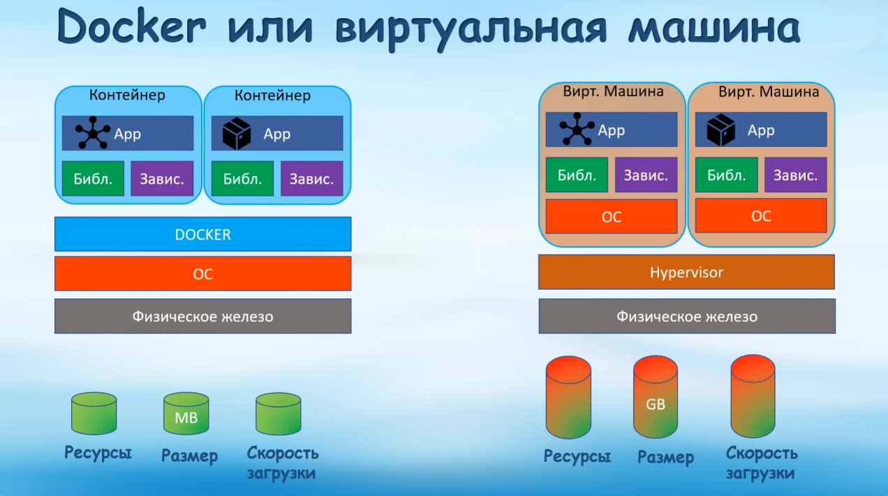

## Chapter II

**nginx** (произносится как "engine-x") - это обратный прокси-сервер с открытым исходным кодом для протоколов HTTP, HTTPS и т.д.
**nginx** также используется, как балансировщик нагрузки, веб-сервер и для кеширования HTTP.
В проекте **nginx** уделяется особое внимание высокому параллелизму, высокой производительности и низкому использованию памяти.
У **nginx** есть один главный и несколько рабочих процессов.
Основная задача главного процесса — чтение и проверка конфигурации и управление рабочими процессами.
Рабочие процессы выполняют фактическую обработку запросов.
Как работают **nginx** и его модули, определяется в конфигурационном файле. По умолчанию, конфигурационный файл называется *nginx.conf*

**Docker** — это платформа, которая предназначена для разработки, развёртывания и запуска приложений в контейнерах. \
Предшественниками контейнеров **Docker** были виртуальные машины.
Виртуальная машина, как и контейнер, изолирует приложение и его зависимости от внешней среды.
Однако контейнеры **Docker** обладают преимуществами перед виртуальными машинами.
Так, они потребляют меньше ресурсов, их очень легко переносить, они быстрее запускаются и приходят в работоспособное состояние.
Докер образ состоит из слоев. Каждый слой описывает какое-то изменение, которое должно быть выполнено с данными на запущенном контейнере.
Структура связей между слоями — иерархическая. Имеется базовый слой, на который «накладываются» остальные слои.
Для создания образа используется *Dockerfile*. Каждая инструкция в нем создает новый слой.

**Dockle** — это инструмент для проверки безопасности образов контейнеров, который можно использовать для поиска уязвимостей. \
Основные функции и преимущества **Dockle**: поиск уязвимостей в образах, помощь в создании правильного Dockerfile, простота в использовании, нужно указать только имя образа, поддержка *CIS Benchmarks*.

**Docker Compose** — это инструментальное средство, которое предназначено для решения задач, связанных с развёртыванием проектов.
Docker Compose может пригодиться, если для обеспечения функционирования проекта используется несколько сервисов.
Docker Compose используется для одновременного управления несколькими контейнерами, входящими в состав приложения.
Этот инструмент предлагает те же возможности, что и Docker, но позволяет работать с более сложными распределенными приложениями, например микросервисными.

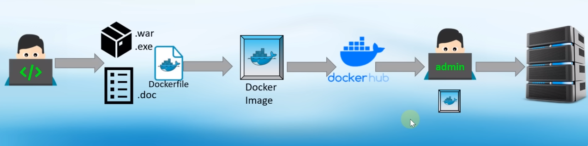

## Chapter III

- В репозиторий, в папке src/part3, загружены исходные файлы для запуска веб-сервера из третьего задания.
- В репозиторий, в папках src/part4 и src/part5, загружены итоговые докерфайлы для запуска образов из четвёртого и пятого заданий.
- В репозиторий, в папке src/part6, загружен *docker-compose.yml* шестого задания.

## Part 1. Готовый докер

В качестве конечной цели моей небольшой практики я сразу выбрала написание докер образа для собственного веб сервера, а потому в начале нужно разобраться с уже готовым докер образом **nginx** для сервера.

`docker run --name my_container -p 80:80 -d nginx`:
- run это команда для создания нового контейнера.
- --name имя контейнера.
- -p pуказывает порт, который вы предоставляете, в формате -p local-machine-port:internal-container-port. В этом случае вы сопоставляете порт :80 в контейнере с портом :80 на сервере.
- -d это флаг, который указывает Docker на запуск контейнера в фоновом режиме (detached mode).
- nginx имя образа в Docker Hub.

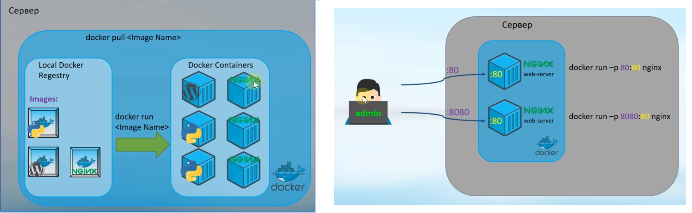

##### Взять официальный докер образ с **nginx** и выкачать его при помощи `docker pull`. Проверить наличие докер образа через `docker images`. Запустить докер образ через `docker run -d [image_id|repository]`. Проверить, что образ запустился через `docker ps`
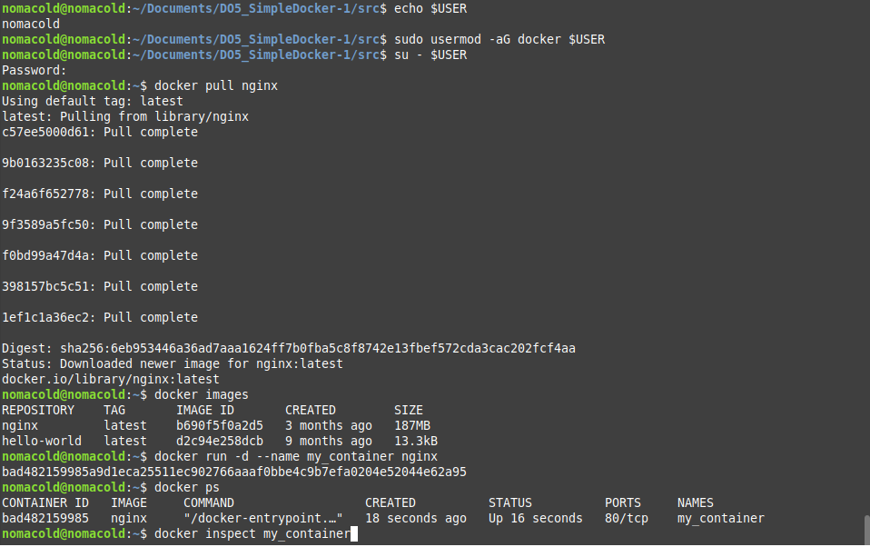

##### Посмотреть информацию о контейнере через `docker inspect [container_id|container_name]`. По выводу команды определить и поместить в отчёт размер контейнера, список замапленных портов и ip контейнера.
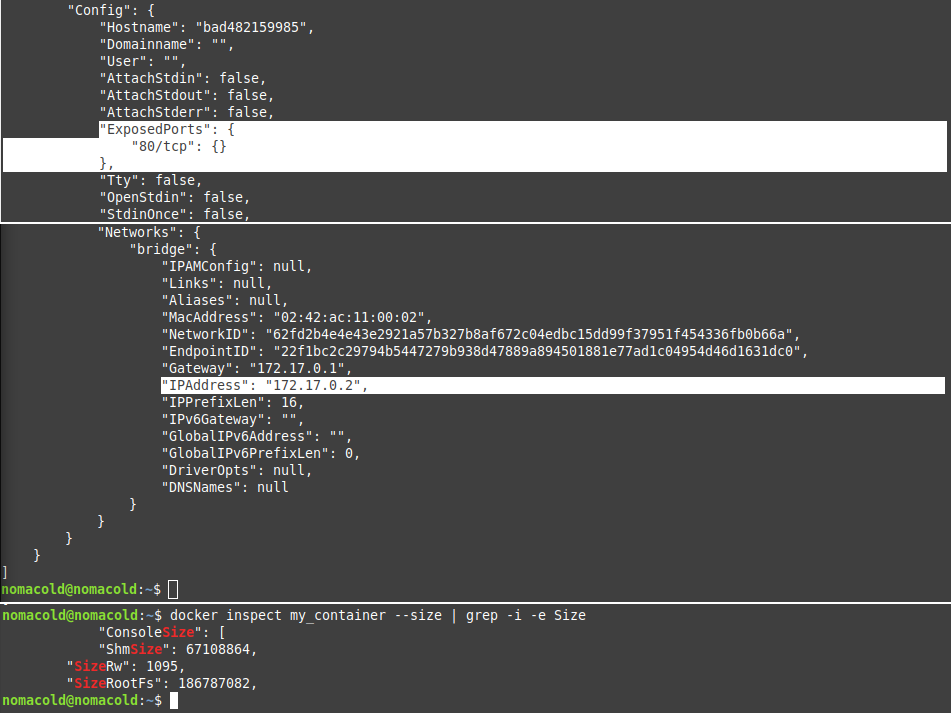

##### Остановить докер образ через `docker stop [container_id|container_name]` и проверить, что образ остановился через `docker ps`.
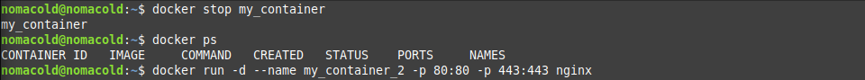

##### Запустить докер с портами 80 и 443 в контейнере, замапленными на такие же порты на локальной машине, через команду *run*. Проверить, что в браузере по адресу *localhost:80* доступна стартовая страница **nginx**.
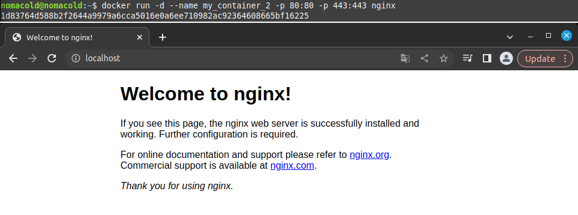

##### Перезапустить докер контейнер через `docker restart [container_id|container_name]` и проверить любым способом, что контейнер запустился.
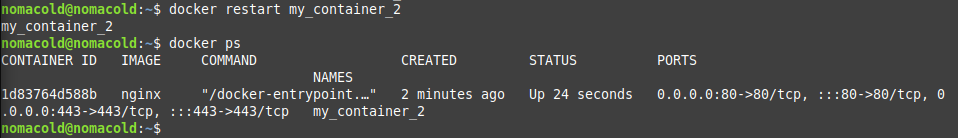

## Part 2. Операции с контейнером

Докер образ и контейнер готовы. Теперь можно покопаться в конфигурации **nginx** и отобразить статус страницы.

##### Прочитать конфигурационный файл *nginx.conf* внутри докер контейнера через команду *exec*
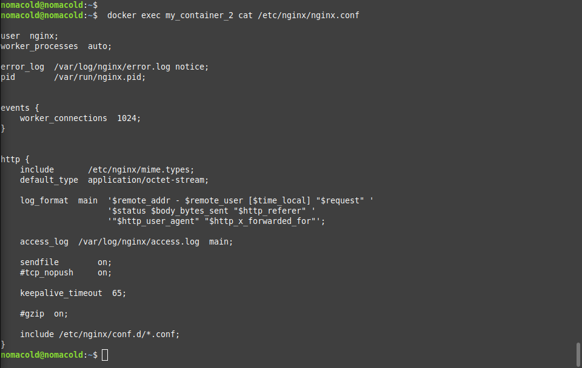

##### Создать на локальной машине файл *nginx.conf* и настроить в нем по пути */status* отдачу страницы статуса сервера **nginx**
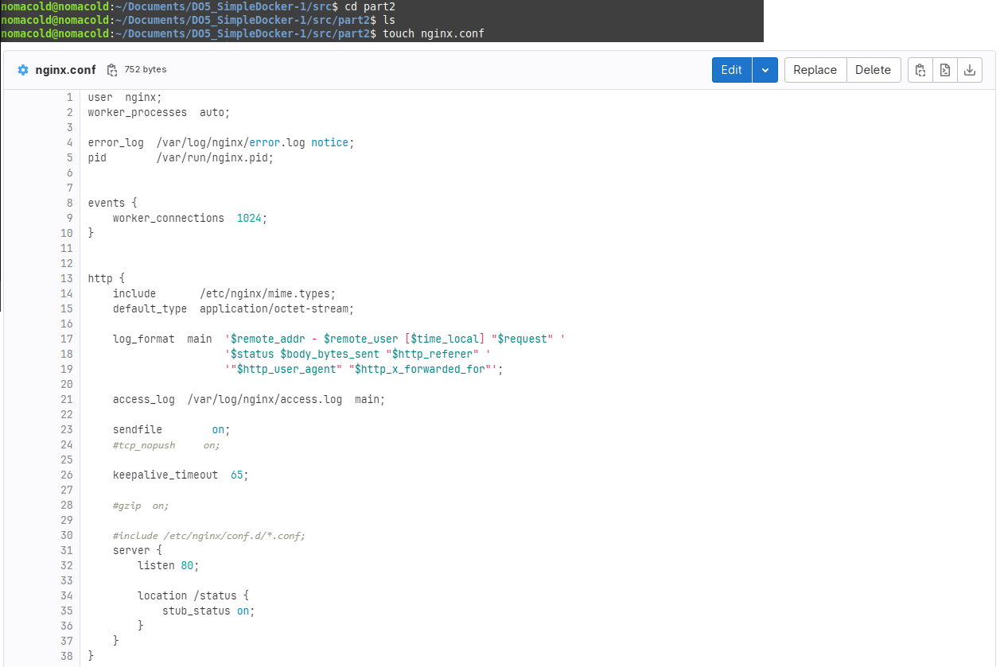

##### Скопировать созданный файл *nginx.conf* внутрь докер образа через команду `docker cp`. Перезапустить **nginx** внутри докер образа через команду *exec*. Проверить, что по адресу *localhost:80/status* отдается страничка со статусом сервера **nginx**.
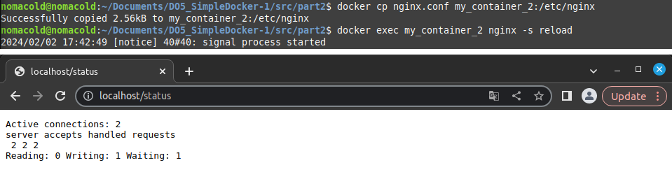

##### Экспортировать контейнер в файл *container.tar* через команду *export*. Остановить контейнер. Удалить образ через `docker rmi [image_id|repository]`, не удаляя перед этим контейнеры. Удалить остановленный контейнер.
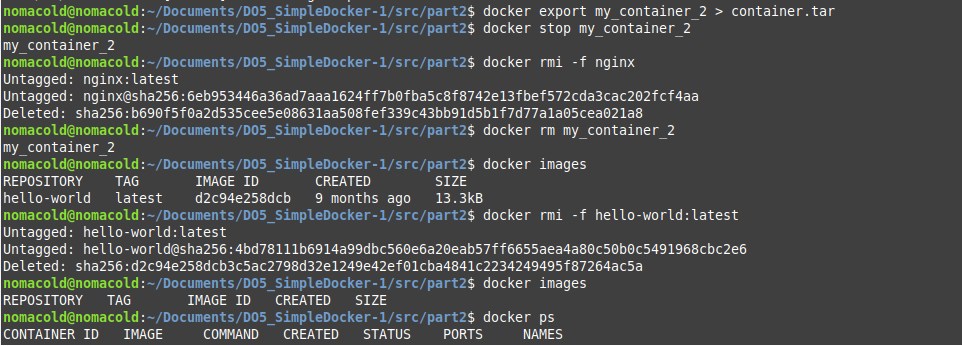

##### Импортировать контейнер обратно через команду *import*. Запустить импортированный контейнер. Проверить, что по адресу *localhost:80/status* отдается страничка со статусом сервера **nginx**.
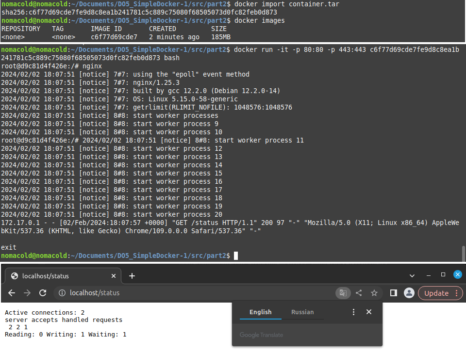

## Part 3. Мини веб-сервер

Настало время немного оторваться от докера, чтобы подготовиться к последнему этапу. Настало время написать свой сервер.

##### Написать мини сервер на **C** и **FastCgi**, который будет возвращать простейшую страничку с надписью `Hello World!`.
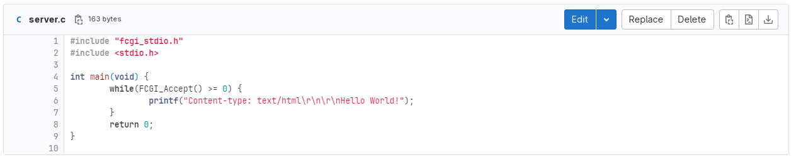

##### Написать свой *nginx.conf*, который будет проксировать все запросы с 81 порта на *127.0.0.1:8080*.
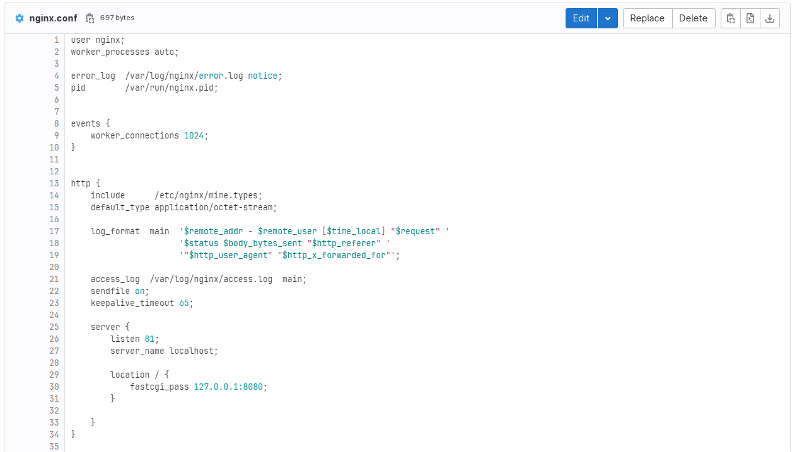

##### Скопировать мини сервер server.c и nginx.conf внутрь докер образа.
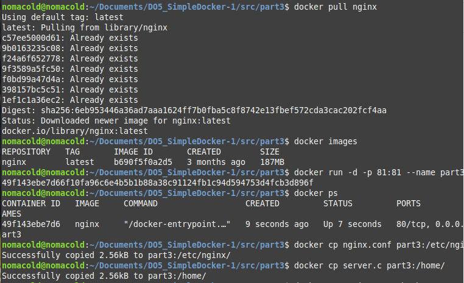

##### Установить требуемые утилиты для запуска мини веб-сервера. Запустить написанный мини сервер через *spawn-fcgi* на порту 8080. Проверить, что в браузере по *localhost:81* отдается написанная вами страничка. 
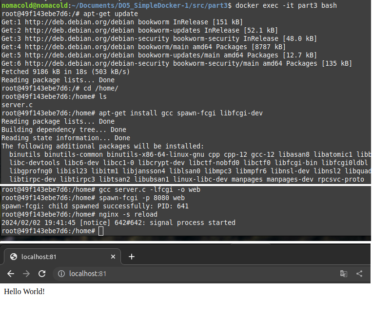

## Part 4. Свой докер

Теперь всё готово. Можно приступать к написанию докер образа для созданного сервера.

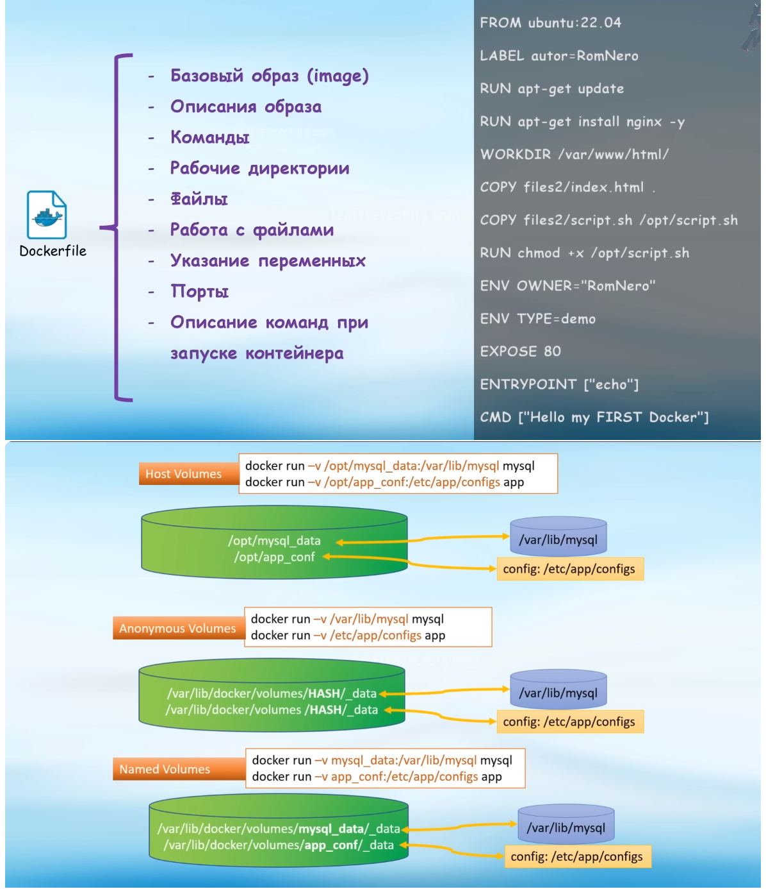

#### Написать свой докер образ, который:
##### 1) собирает исходники мини сервера на FastCgi из [Части 3](#part-3-мини-веб-сервер)
##### 2) запускает его на 8080 порту
##### 3) копирует внутрь образа написанный *./nginx/nginx.conf*
##### 4) запускает **nginx**.
_**nginx** можно установить внутрь докера самостоятельно, а можно воспользоваться готовым образом с **nginx**'ом, как базовым._
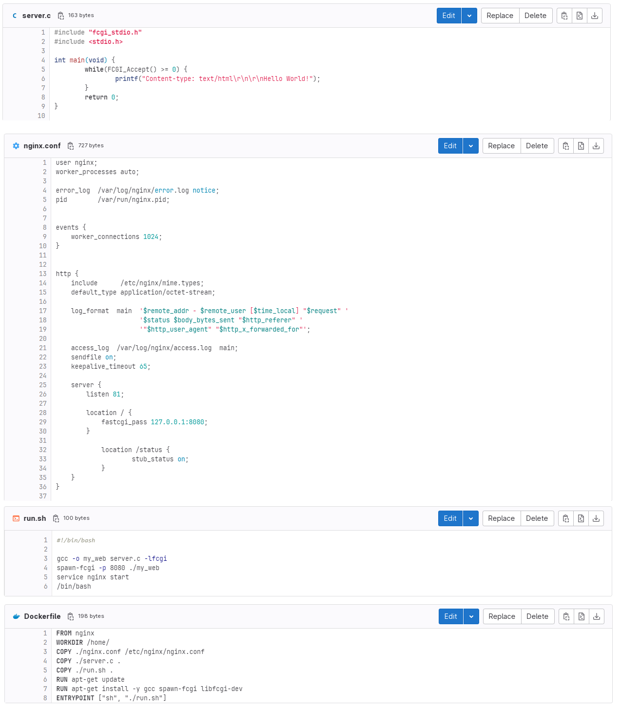

##### Собрать написанный докер образ через `docker build` при этом указав имя и тег. Проверить через `docker images`, что все собралось корректно.
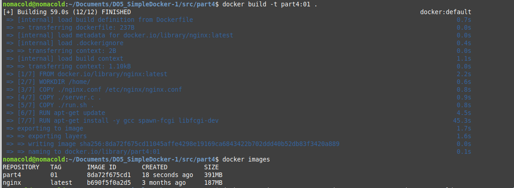

##### Запустить собранный докер образ с маппингом 81 порта на 80 на локальной машине и маппингом папки *./nginx* внутрь контейнера по адресу, где лежат конфигурационные файлы **nginx**'а. Проверить, что по localhost:80 доступна страничка написанного мини сервера.
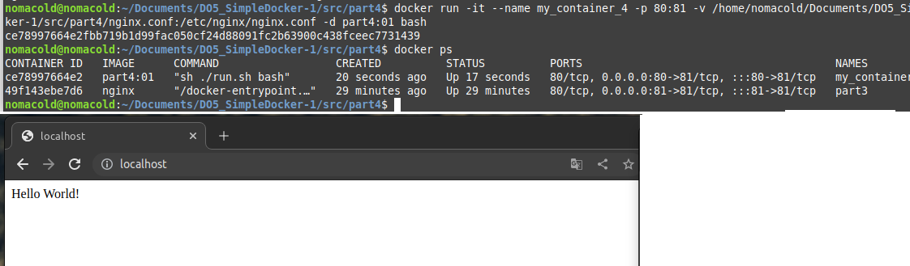

##### Дописать в *./nginx/nginx.conf* проксирование странички */status*, по которой надо отдавать статус сервера **nginx**. Перезапустить докер образ. Проверить, что теперь по *localhost:80/status* отдается страничка со статусом **nginx**.
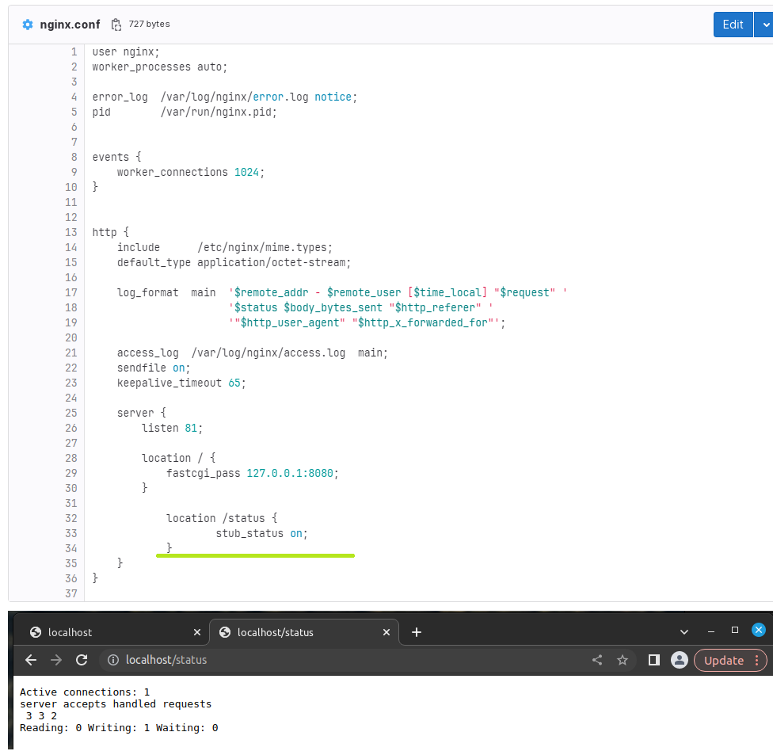

## Part 5. **Dockle**

После написания образа никогда не будет лишним проверить его на безопасность.

##### Просканировать образ из предыдущего задания через `dockle [image_id|repository]`
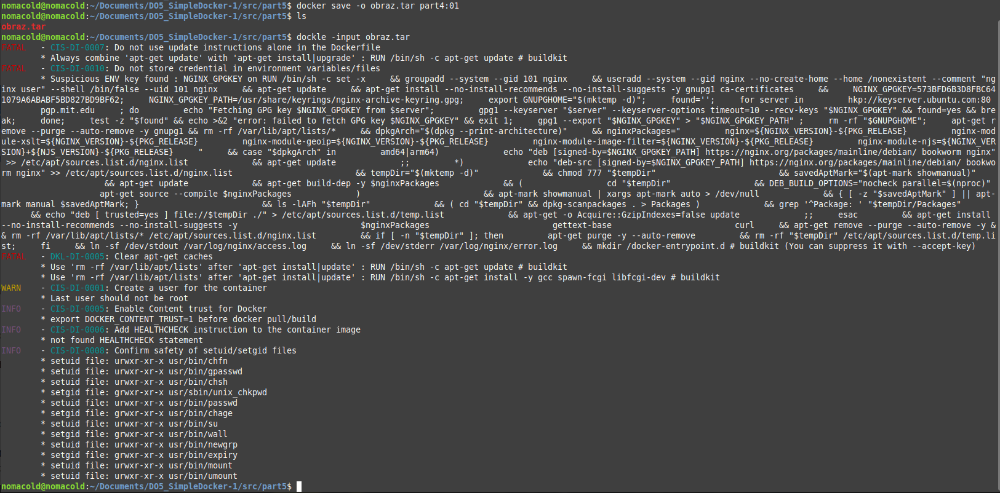

##### Исправить образ, чтобы не было ошибок и предупреждений.
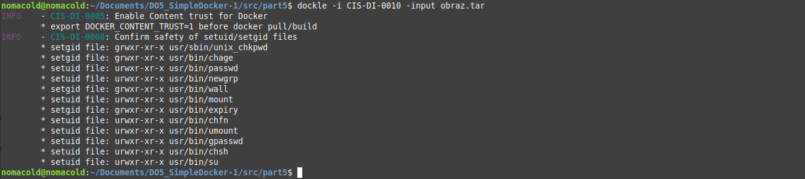

## Part 6. Базовый **Docker Compose**

Почему бы не поэкспериментировать с развёртыванием проекта, состоящего сразу из нескольких докер образов?

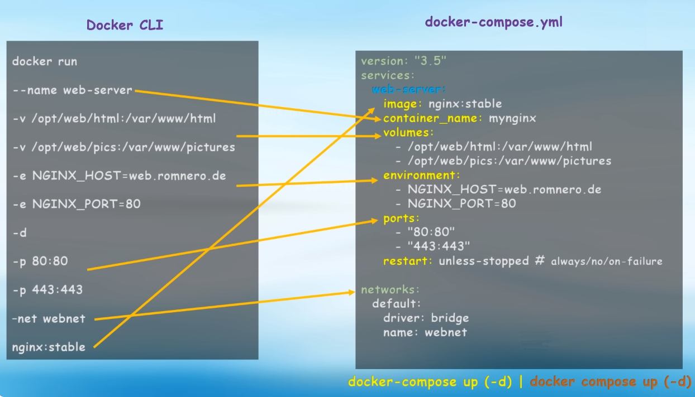

##### Остановить все запущенные контейнеры
##### Написать файл *docker-compose.yml*, с помощью которого:
##### 1) Поднять докер контейнер из [Части 5](#part-5-инструмент-dockle) _(он должен работать в локальной сети, т.е. не нужно использовать инструкцию **EXPOSE** и мапить порты на локальную машину)_
##### 2) Поднять докер контейнер с **nginx**, который будет проксировать все запросы с 8080 порта на 81 порт первого контейнера
##### Замапить 8080 порт второго контейнера на 80 порт локальной машины
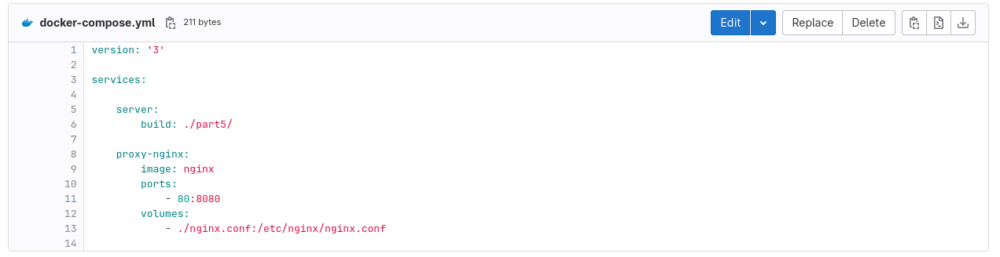

##### Собрать проект с помощью команды `docker-compose build`
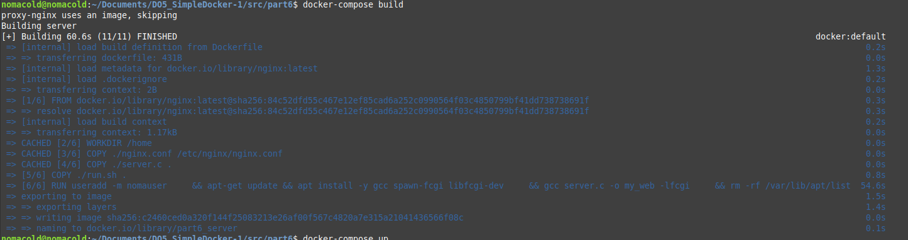

##### Запустить проект с помощью команды `docker-compose up`
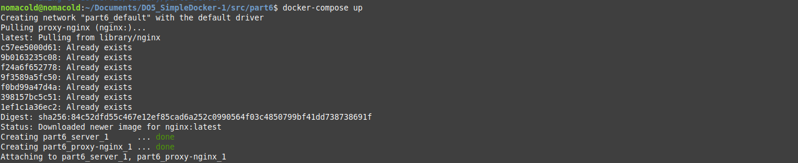

##### Проверить, что в браузере по *localhost:80* отдается написанная вами страничка, как и ранее
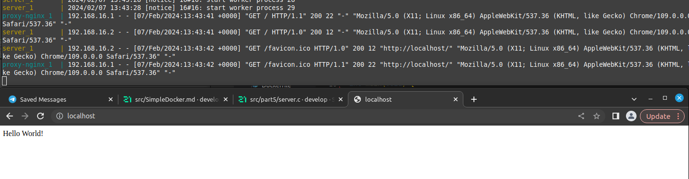

